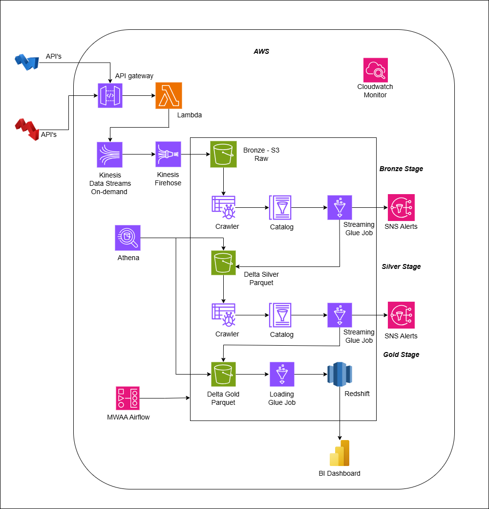

# Real-Time Stock Market Analytics Lakehouse Platform

## Project Overview

This project is a **production-grade real-time streaming lakehouse platform** built on AWS using **Kinesis, Firehose, PySpark Structured Streaming, Delta Lake, Glue, Redshift, Airflow (MWAA), and Terraform**.

The platform ingests real-time stock market trade events, processes them through scalable streaming and incremental ETL pipelines, and generates near real-time analytical insights for dashboards and downstream analytics systems.

The architecture follows a modern **Medallion Lakehouse Architecture (Bronze → Silver → Gold)** with support for:

- Real-time streaming ingestion
- Scalable raw event buffering
- Incremental ETL processing
- Stateful stream aggregations
- Watermarking & late data handling
- Exactly-once guarantees
- Idempotent MERGE operations
- Delta Lake optimization
- Monitoring & alerting
- Infrastructure as Code using Terraform

---

# Architecture



## High-Level Workflow

```text
Stock Market Event Producer
            ↓
API Gateway
            ↓
AWS Lambda
            ↓
Amazon Kinesis Data Streams
            ↓
Amazon Kinesis Firehose
            ↓
S3 Bronze Layer (Raw Parquet)
            ↓
Glue Incremental ETL
            ↓
Silver Delta Lake
            ↓
Streaming Aggregation Layer
            ↓
Gold Delta Layer
            ↓
Amazon Redshift / Athena
            ↓
Real-Time Dashboard & Analytics
```

---

# Medallion Architecture

---

# Bronze Layer

## Purpose

Stores immutable raw streaming events delivered from Firehose into Amazon S3.

This layer acts as:
- raw archival storage
- replay source
- disaster recovery layer

---

## Features

- Fully managed ingestion using Firehose
- Auto scaling ingestion
- Buffered parquet file delivery
- Cost-optimized storage
- Replayable raw data
- Partitioned S3 storage
- Near real-time ingestion

---

## Bronze Storage Format

Raw parquet files stored in:

```text
s3://stock-market-bronze/
```

Partitioned by:

```text
year/month/day/hour
```

---

# Silver Layer

## Purpose

Performs incremental ETL processing, cleansing, deduplication, and Delta Lake conversion.

The Silver layer converts raw parquet files into ACID-compliant Delta tables.

---

## Features

- Incremental Glue ETL
- Delta Lake conversion
- Watermarking
- Deduplication
- Schema evolution
- Data quality checks
- Idempotent MERGE logic
- Exactly-once processing

---

## Key Transformations

### Watermarking

Handles late-arriving stock events.

```python
.withWatermark("event_time", "20 minutes")
```

---

### Deduplication

Avoids duplicate trade events.

```python
.dropDuplicates(["event_id"])
```

---

### Delta MERGE

Ensures:
- idempotent writes
- retry safety
- CDC handling

---

## Why Silver Uses Delta Lake?

Delta Lake provides:

| Feature | Benefit |
|---|---|
| ACID Transactions | Reliable concurrent writes |
| Schema Evolution | Flexible schema updates |
| Time Travel | Historical recovery |
| Optimistic Concurrency | Safe parallel operations |
| Efficient Metadata | Faster query planning |

---

# Gold Layer

## Purpose

Generates analytical aggregations for dashboards and reporting systems.

This layer powers near real-time stock market analytics.

---

## Real-Time Metrics

- Top traded stocks
- Rolling 1-hour trade volume
- Buy/Sell ratio
- Moving averages
- VWAP calculations
- Exchange-wise trade analytics
- Top gainers & losers

---

## Stateful Window Aggregations

Example:

```python
groupBy(
    window(col("event_time"), "60 minutes", "1 minute"),
    col("stock_symbol")
)
```

---

## Why Rolling Windows?

Rolling windows allow:
- continuously updated analytics
- low-latency dashboards
- efficient state management

---

# Technology Stack

| Category | Technologies |
|---|---|
| Streaming Ingestion | Amazon Kinesis Data Streams |
| Streaming Delivery | Amazon Kinesis Firehose |
| Stream Processing | PySpark Structured Streaming |
| ETL | AWS Glue |
| Lakehouse | Delta Lake |
| Storage | Amazon S3 |
| Query Engine | Amazon Athena |
| Warehouse | Amazon Redshift |
| Orchestration | AWS MWAA (Airflow) |
| Monitoring | CloudWatch |
| Alerts | SNS |
| Infrastructure | Terraform |

---

# Key Streaming Concepts Implemented

---

# Watermarking

Handles late-arriving events efficiently.

```python
.withWatermark("event_time", "20 minutes")
```

---

# Stateful Processing

Used for rolling aggregations and window analytics.

---

# Checkpointing

Maintains:
- streaming offsets
- state management
- fault tolerance
- exactly-once guarantees

Checkpoint directories are stored in Amazon S3.

---

# Delta MERGE

Used for:
- idempotent writes
- retry-safe operations
- CDC handling
- duplicate prevention

---

# Incremental ETL

Silver ETL jobs process only newly arrived Bronze files instead of reprocessing entire datasets.

---

# Project Structure

```text
realtime-stock-market-lakehouse/
│
├── airflow/
│   └── stock_market_pipeline_dag.py
│
├── terraform/
│   ├── provider.tf
│   ├── s3.tf
│   ├── glue.tf
│   ├── mwaa.tf
│   ├── sns.tf
│   ├── cloudwatch.tf
│   └── kinesis.tf
│
├── glue_jobs/
│   ├── silver_streaming_etl.py
│   ├── gold_streaming_etl.py
│   └── redshift_loader.py
│
├── architecture/
│   └── architecture.png
│
└── README.md
```

---

# Infrastructure Provisioning

Infrastructure is fully automated using Terraform.

---

## Provisioned AWS Services

- Amazon S3
- Amazon Kinesis Data Streams
- Amazon Kinesis Firehose
- AWS Glue Jobs
- AWS Glue Crawlers
- Amazon Redshift
- AWS MWAA
- SNS Topics
- CloudWatch Alarms

---

# Real-Time Analytics Examples

---

## Rolling Trade Volume

```text
AAPL → 1.2M shares traded in last 1 hour
```

---

## Top Gainers

```text
NVDA → +4.8%
```

---

## Buy/Sell Ratio

```text
BUY : SELL → 3.2 : 1
```

---

# Production-Level Optimizations

---

# Delta Lake Optimizations

## OPTIMIZE

Compacts small parquet files.

---

## ZORDER

Improves query performance and data skipping.

```sql
OPTIMIZE gold_stock_analytics
ZORDER BY (stock_symbol, event_time)
```

---

# Partitioning Strategy

Partitioned by:
- year
- month
- day
- hour

Benefits:
- reduced Athena scan cost
- faster query performance
- efficient pruning

---

# Monitoring & Alerting

---

## CloudWatch Monitoring

Monitored Metrics:
- Kinesis throughput exceeded
- Firehose delivery failures
- Glue ETL failures
- Spark executor failures
- Streaming lag
- State store growth
- Redshift load failures

---

## SNS Alerts

SNS notifications configured for:
- Glue job failures
- MWAA task failures
- Kinesis throttling
- Firehose delivery issues
- SLA misses

---

# Failure Scenarios Handled

---

## Duplicate Events

Handled using:
- watermarking
- deduplication
- Delta MERGE

---

## Checkpoint Failures

Checkpoint directories stored in S3 to maintain:
- fault tolerance
- exactly-once guarantees
- recovery capability

---

## Small File Problem

Handled using:
- Firehose buffering
- OPTIMIZE compaction
- repartitioning

---

## Hot Shards

Mitigated using:
- balanced partition keys
- shard scaling

---

## Data Skew

Handled using:
- AQE
- salting
- repartitioning

---

# Key Learning Outcomes

- Streaming lakehouse architecture
- Spark Structured Streaming internals
- Delta Lake transaction management
- Stateful streaming systems
- Real-time financial analytics
- AWS streaming ecosystem
- Scalable ETL design
- Production-grade monitoring
- Infrastructure automation

---

# Future Enhancements

- Kafka integration
- ML-based stock anomaly detection
- Grafana dashboards
- Iceberg/Hudi comparison
- Multi-region failover
- Kubernetes deployment
- Real-time alert engine

---

# Author

**Zumare Pasha**
Data Engineer

AWS | PySpark | Streaming | Delta Lake | Data Engineering